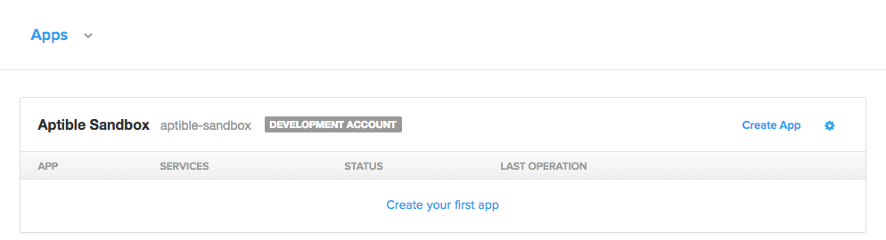
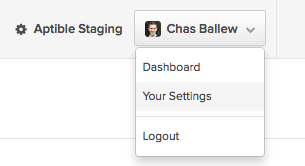
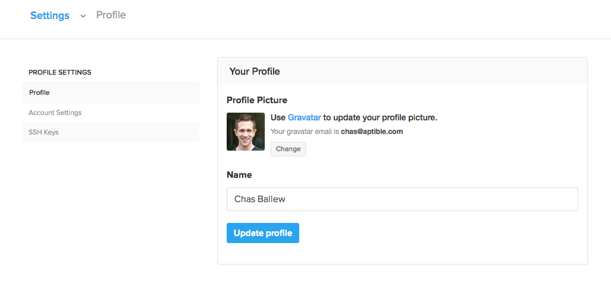
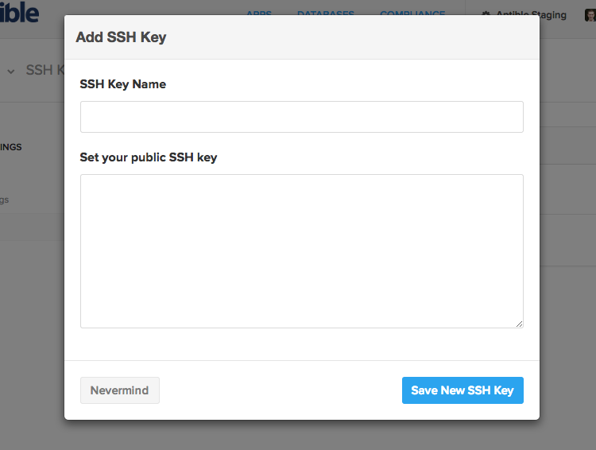
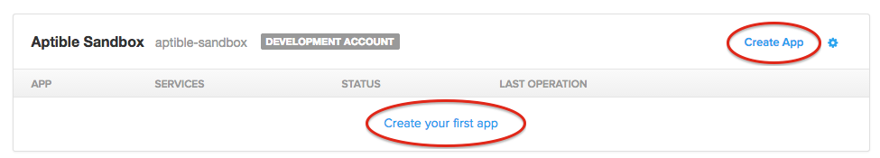
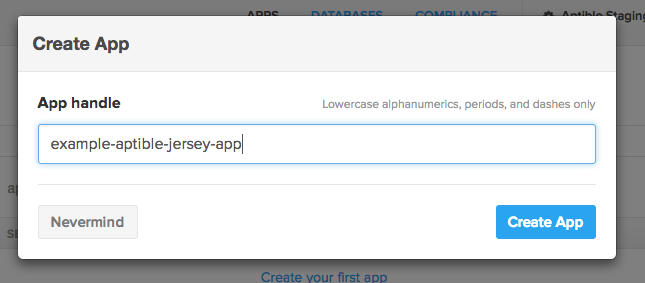

#  aptible/docker-jersey-example
How to Deploy Your First Jersey App on Aptible

For reference, we are going to replicate the Jersey setup guide using their [Heroku webapp Maven archetype](https://jersey.java.net/documentation/latest/getting-started.html#heroku-webapp).

## Local Setup
This guide assumes you have Java, the Java compiler, Maven, and the [Aptible CLI tool](https://support.aptible.com/hc/en-us/articles/202320954-How-do-I-install-the-command-line-interface-CLI-tool-) all set up and working.

```bash
$ java -version
java version "1.8.0_25"
Java(TM) SE Runtime Environment (build 1.8.0_25-b17)
Java HotSpot(TM) 64-Bit Server VM (build 25.25-b02, mixed mode)

$ javac -version
javac 1.8.0_25

$ mvn -version
Apache Maven 3.2.1 [etc etc]

$ aptible version
aptible-cli v0.5.1
```
If you don't have the [Aptible CLI tool](https://support.aptible.com/hc/en-us/articles/202320954-How-do-I-install-the-command-line-interface-CLI-tool-), install it easily with RubyGems:
```
gem install aptible-cli
```

For faster CLI performance, install the Aptible CLI Toolbelt. This pins versions of each depencency gem.
```
gem install aptible-toolbelt
```

## Aptible Setup
This guide assumes you have a Dev Account and have uploaded an SSH key.

Look for your Dev Account in the Apps section of the Aptible Dashboard:


To upload an SSH key, find the account dropdown:


Go to your user settings page:


Copy/paste your key:


GitHub has a [good set of instructions for generating SSH keys](https://help.github.com/articles/generating-ssh-keys/), if you need to.

## Steps
### 1. Write some code

The sample code in `example-aptible-jersey-app` was generated using the following command:
```
mvn archetype:generate -DarchetypeArtifactId=jersey-heroku-webapp \
                       -DarchetypeGroupId=org.glassfish.jersey.archetypes \
                       -DinteractiveMode=false -DgroupId=com.example \
                       -DartifactId=example-aptible-jersey-app \
                       -Dpackage=com.example -DarchetypeVersion=2.14
cd example-aptible-jersey-app/
```
You can clone this repo and use that code for your example, but we recommend you generate it from the Maven archetype.

Of course, you can always start with your own source, too.

### 2. Add a Dockerfile
In the root of your repo, add a Dockerfile. It must be named `Dockerfile` exactly - no extension, capital "D".

An example Dockerfile for building using [tutum/buildstep](https://github.com/tutumcloud/buildstep) is located [in this repo](Dockerfile).

In most real-world cases, you will want to construct a customer Dockerfile to control your build. [Just ask us](https://www.aptible.com/support/) if you would like assistance in doing so.

### 3. Commit your code
Commit your code to version control. If you started with your own source code, remember to commit the Dockerfile!
```
git init .
git add Dockerfile Procfile pom.xml src/ system.properties
git commit -m "Initial commit"
```

### 3. Provision the app
We will need to provision an app in Aptible, using either the CLI tool or the Aptible Dashboard.

From the command line:
``` 
aptible apps:create example-aptible-jersey-app
```

In the Dashboard, Apps view, click either of the app creation buttons in your account:


Now give it a handle:


You will notice that your app has no services configured. We need to push some code to the app so Aptible can determine what services should be running and how many containers to allocate.

### 4. Add a Git remote
In your repo:
``` 
git remote add aptible git@beta.aptible.com:example-aptible-jersey-app.git
```

If you are using a different app handle:
``` 
git remote add aptible git@beta.aptible.com:<handle>.git
```

### 5. Push
If necessary, login with the Aptible CLI tool:
```
aptible login
```

Now just push it up and enjoy the show:
```
git push aptible master
```

If it doesn't work at first, make sure you committed your Dockerfile. You will likely want to [set up logs for your account](https://support.aptible.com/hc/en-us/articles/202315974-How-do-I-set-up-production-logs-) in order to troubleshoot as you go.

If you have any questions, [contact us](https://www.aptible.com/support/) and we will be happy to answer them. Good luck, and have fun!

## Copyright and License

MIT License, see [LICENSE](LICENSE.md) for details.

Copyright (c) 2014 [Aptible](https://www.aptible.com) and contributors.

[](https://github.com/fancyremarker)
